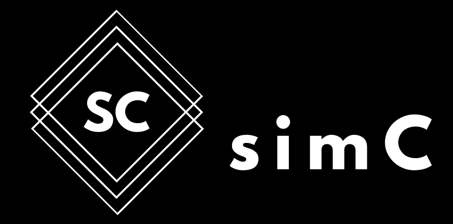

# sim-C

  

              

# Hacktoberfest 2020

Hacktoberfest 2020 is here. Contributions are now welcome. Please go through [CONTRIBUTING.md](./CONTRIBUTING.md) and the instructions in readme [Contribute](#contribute). We look forward for your contributions.

## What is sim-C?

Often people have trouble programming in C (especially beginners) due to its low level syntax and unavailability of stable third party libraries. We present sim-C a high-level front end for C which creates a dynamically typed syntax for C. User can write code in this high level syntax and then compile it to optimized C code. sim-C does not process the code and simply translates it to C thus, there is no possibility of the code running slowly. So, with sim-C users can write code faster using the high level syntax and at the same time be able to harness the power and speed of a C program. Let us make C cool again.

## Pipeline

  

## Start Contributing

sim-C which has a highly intuitive codebase, you'll be ready to contribute in no time!
While adding any functionality to sim-C you need to make changes in the following files only:

1. <strong>lexical_analyzer.py</strong>
Lexical analysis is the first phase of a compiler. It takes the modified source code from language preprocessors that are written in the form of sentences. The lexical analyzer breaks these syntaxes into a series of tokens, by removing any whitespace or comments in the source code. Depending on the type of functionality add it to the respective function: is_keyword, numeric_val, string_val, keyword_identifier and/or lexical_analyze.

2. <strong>op_code.py</strong>
It is responsible for creating opcodes. If need be you need to change the opcode2dig function only which returns the integer representation of opcode type.

3. <strong>simc_parser.py</strong>
Parser is an interpreter component that is used to break the data into smaller elements coming from lexical analysis phase. A parser takes input in the form of sequence of tokens and produces output. Here you may need to create a separate function which defines the grammar and checks for the syntax. The function should return the OpCode. Also, if need be you have to append the functionality to the parse function which parses the tokens, calls the particular function and returns opcodes.

4. <strong>compiler.py</strong>
Finally you need to define the opcode type in the compiler and write the expected C syntax for the functonality.

You can write a test in test.simc and verify whether it's producing results in the test.c file.

## Contributing

To get started with simC follow the official documentation:- https://cimplec.github.io/docs/

The following resources are a good place to get to know more about simC:-

1) Writing code in C? Simplify your life with sim-C <a href="https://dev.to/cimplec/writing-code-in-c-simplify-your-life-with-sim-c-2dkj">Dev.to</a>, <a href="https://medium.com/oss-build/writing-code-in-c-simplify-your-life-with-sim-c-9dd98f882bf8">Medium</a>.
2) Getting Started with sim-C <a href="https://dev.to/cimplec/getting-started-with-sim-c-4iek">Dev.to</a>, <a href="https://medium.com/oss-build/getting-started-with-sim-c-1397ee539877">Medium</a>.

Apart from these blog posts, you can also checkout the <a href="https://cimplec.github.io/docs">official docs</a>.

### Instructions for first time contributors/beginner level contributors for question related issues during HACKTOBERFEST

- Start working on the issues once you are assigned to them. Head over to the issue and comment that you want it to be assigned to you. Once the maintainer assigns the issue to you, start working on it. Issues will be assigned on a First Come First Serve (FCFS) basis.
- Once the issue is assigned, you have one week (7 Days) to submit the PR. Failing to do so will get the issue reassigned to someone else. As each issue related to questions are being assigned to single contributor at a time, we sincerely hope that you cooperate with us.
- If you create a PR without the issue being assigned to you, the PR will be marked spam as you are not adhering to the rules.   
- The simC code that you write has to placed in the location simc-codes directory. If not found in the right place, our maintainers would write a comment to the PR as a warning and if the correct location is still not provided on the resubmission, the PR would be marked spam for not adhering to the rules.

Before moving further please go through the rules in [CONTRIBUTING.md](./CONTRIBUTING.md)   

## License

sim-C is licensed under GNU General Public License (GPL) v3.0. [LICENSE](./LICENSE)

## The Team

- [Siddhartha Dhar Choudhury](https://github.com/frankhart2018)
- [Dhairya Jain](https://github.com/dhairyaj)
- [Pranshul Dobriyal](https://github.com/PranshulDobriyal)
- [Aayush Agarwal](https://github.com/Aayush-99)

## Featured Contributors

List of contributors who contributed in a some features of simC

- [YJDoc2](https://github.com/YJDoc2) - <a href="https://cimplec.github.io/docs/doc.html#rawc">Raw C code</a> support.
